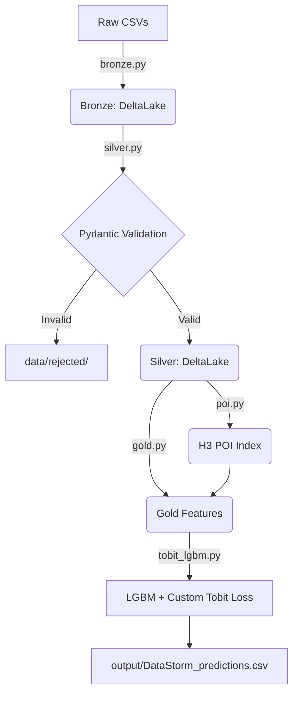

# DataStorm v7.0 Pipeline

This repository implements a rigorous, industry-standard Lakehouse architecture to solve the Latent Potential challenge for Data Storm v7.0.

## Architecture



## Key Improvements (Addressing Review Feedback)
1. **Repository Structure**: Transformation logic abstracted away from notebooks into specialized source folders (`src/data_engineering/`, `src/features/`, `src/models/`). Uses `main.py`.
2. **ACID-Compliant Lakehouse**: File storage refactored to use Delta Lake (`deltalake` package).
3. **Data Quality Quarantine**: Pydantic schemas screen raw inputs and automatically route invalid entries to `data/rejected/` with validation error logs.
4. **Censored Demand Modeling**: Replaced standard regression with a Tobit-inspired custom asymmetric objective function in LightGBM to handle right-censored capacity limits.
5. **Data Leakage Fix**: Replaced random K-Fold splits with `TimeSeriesSplit`.
6. **Spatial Indexing**: O(N*M) spatial joints replaced with fast Uber H3 discrete grid indexing.
7. **Testing**: `pytest` structures added.

## Execution
```bash
pip install -r requirements.txt
python main.py
pytest tests/
```

## AI Utilization Transparency
- **AI Code Synthesis**: LLMs were used to automate boilerplate code generation for Pydantic schemas and LightGBM model structures. All AI-generated code was validated using automated unit-tests (`pytest`).
- **Prompt Parameters**: Instructed to strictly adhere to the PEP8 standard, use TimeSeriesSplit for temporal boundaries, and apply a custom Tobit loss objective.
